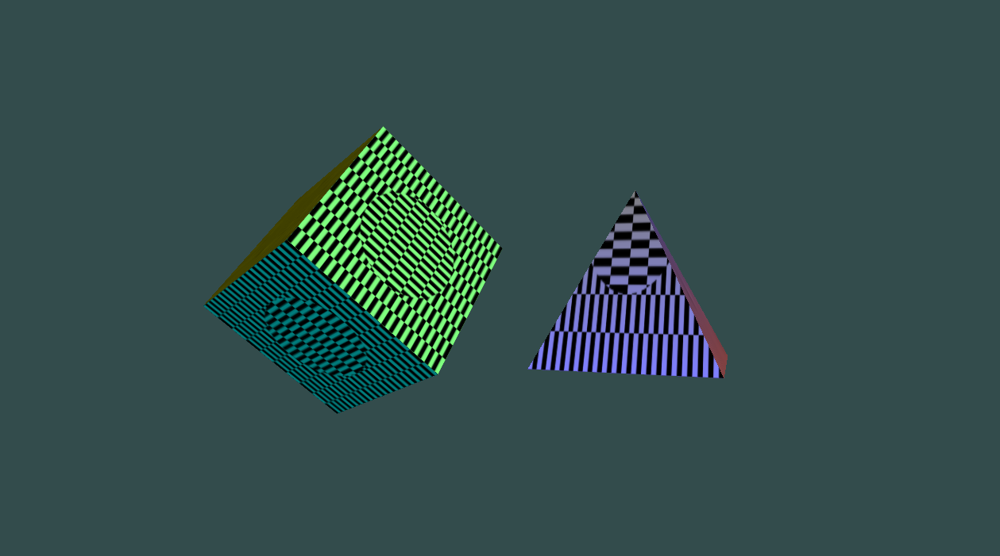

# Nexavey
<p align="center">
  
</p>

## Compilation (linux only)
To compile you need GLFW, CMake and Ninja installed on your system.
<br>
If above requirements are fulfilled, just run the following
```bash
mkdir build && cd build
CXX=clang++ cmake -GNinja -DCMAKE_BUILD_TYPE=Release ..
ninja
./Nexavey
```
<br>

> **Note:**
> This project is currently on hold due to personal matters, but I plan to return to it ASAP.
