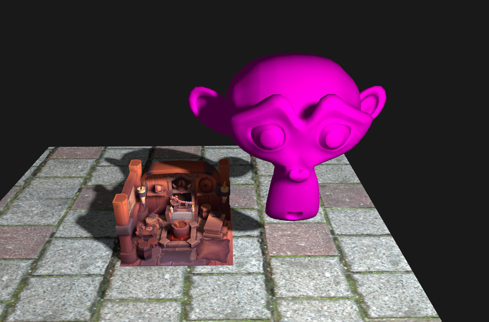

# Nexavey
A graphics engine created with the Vulkan API for personal learning and experimentation.  
Currently in early stages of development.

## Implemented Features
- [x] OBJ loading (single mesh)
- [x] MSAA (Multisample Anti-Aliasing)
- [x] Directional lighting and shadow mapping
- [x] Point lights

## Planned Features For Near Future
- [ ] glTF model loading (with PBR support)
- [ ] Omnidirectional shadow maps
- [ ] Mipmaps for textures
- [ ] ImGui integration

## Compilation (linux only)
To compile you need GLFW, CMake and Ninja installed on your system.
<br>
If above requirements are fulfilled, just run the following
```bash
mkdir build && cd build
CXX=clang++ cmake -GNinja -DCMAKE_BUILD_TYPE=Release ..
ninja
./Nexavey
```
<br>

<p align="center">
  
</p>
